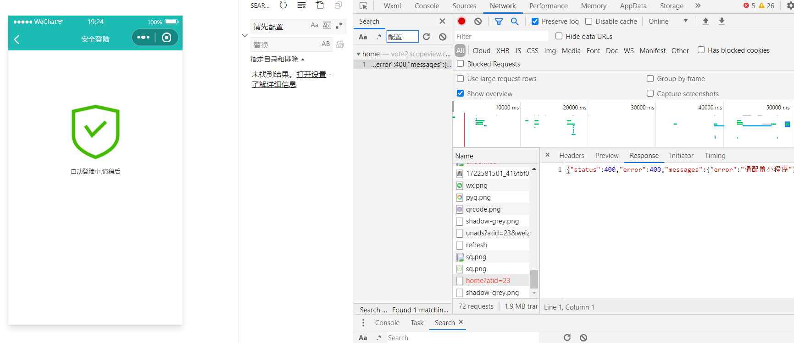
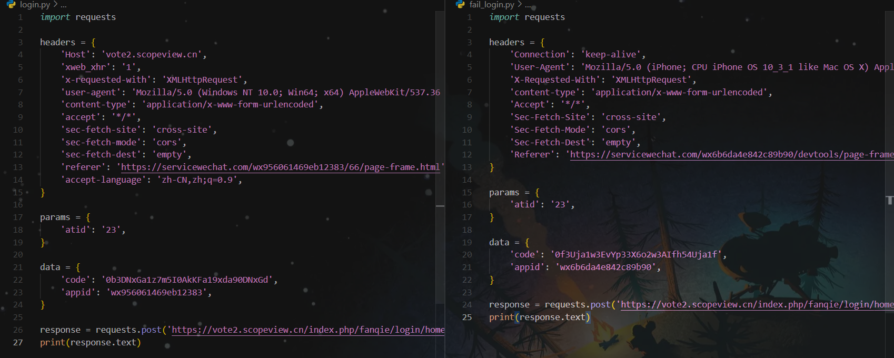

# 登录

提示“请配置小程序”




先正常抓个包

```bash
curl -H "Host: vote2.scopeview.cn" -H "xweb_xhr: 1" -H "x-requested-with: XMLHttpRequest" -H "user-agent: Mozilla/5.0 (Windows NT 10.0; Win64; x64) AppleWebKit/537.36 (KHTML, like Gecko) Chrome/122.0.0.0 Safari/537.36 MicroMessenger/7.0.20.1781(0x6700143B) NetType/WIFI MiniProgramEnv/Windows WindowsWechat/WMPF WindowsWechat(0x6309092b)XWEB/11205" -H "content-type: application/x-www-form-urlencoded" -H "accept: */*" -H "sec-fetch-site: cross-site" -H "sec-fetch-mode: cors" -H "sec-fetch-dest: empty" -H "referer: https://servicewechat.com/wx956061469eb12383/66/page-frame.html" -H "accept-language: zh-CN,zh;q=0.9" --data-binary "code=0b3DNxGa1z7m5I0AkKFa19xda90DNxGd&appid=wx956061469eb12383" --compressed "https://vote2.scopeview.cn/index.php/fanqie/login/home?atid=23"
```

这是在微信开发者工具里的
```bash
curl 'https://vote2.scopeview.cn/index.php/fanqie/login/home?atid=23' \
  -H 'Connection: keep-alive' \
  -H 'User-Agent: Mozilla/5.0 (iPhone; CPU iPhone OS 10_3_1 like Mac OS X) AppleWebKit/603.1.3 (KHTML, like Gecko) Version/10.0 Mobile/14E304 Safari/602.1 wechatdevtools/1.06.2209190 MicroMessenger/8.0.5 Language/zh_CN webview/' \
  -H 'X-Requested-With: XMLHttpRequest' \
  -H 'content-type: application/x-www-form-urlencoded' \
  -H 'Accept: */*' \
  -H 'Sec-Fetch-Site: cross-site' \
  -H 'Sec-Fetch-Mode: cors' \
  -H 'Sec-Fetch-Dest: empty' \
  -H 'Referer: https://servicewechat.com/wx6b6da4e842c89b90/devtools/page-frame.html' \
  --data-raw 'code=0f3Uja1w3EvYp33X6o2w3AIfh54Uja1f&appid=wx6b6da4e842c89b90' \
  --compressed
```



对比可以看到，headers里少了`xweb_xhr`，ua不同，data里的`code`和`appid`也不同。


运行login.py
```
{"status":400,"error":400,"messages":{"error":"40163code been used, rid: 66d0632f-61ff8846-38dd9a3e"}}
```
开发工具里的
```
{"status":400,"error":400,"messages":{"error":"请配置小程序"}}
```

尝试在右侧代码中加上`xweb_xhr`

